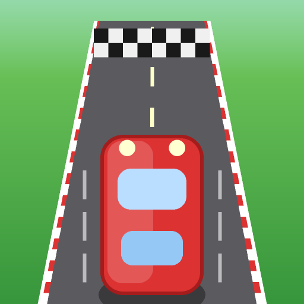
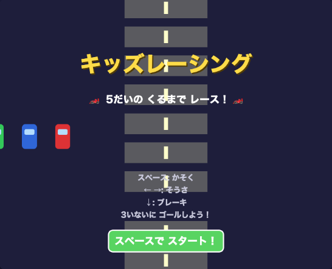
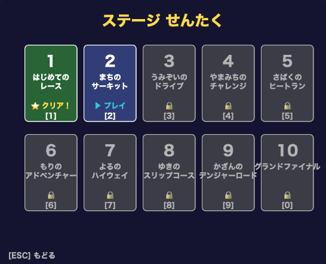
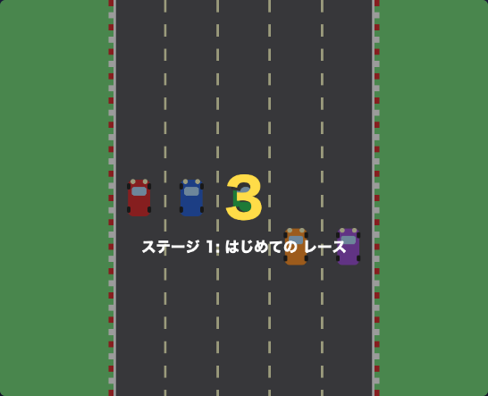

# 🏎️ キッズレーシング (Kids Racing)

5だいの くるまで ゴールまでの はやさを きそう、**こども むけ レースゲーム**！
ぜん **10ステージ**、すすむほど むずかしくなるよ。

🎮 **いますぐ あそぶ → [https://shitada.github.io/kids-racing/](https://shitada.github.io/kids-racing/)**

<p align="center">
  
</p>

> もともと Python / pygame で つくった ゲーム ([`racing_game.py`](racing_game.py)) を、
> デザイン・おんがく・ないようは **そのまま** に、ブラウザ (HTML5 Canvas + Web Audio) へ いしょく しました。

---

## 📸 スクリーンショット

| タイトル | ステージせんたく | レース |
| :---: | :---: | :---: |
|  |  |  |

---

## 🕹️ そうさ ほうほう

### パソコン (キーボード)

| キー | はたらき |
| :---: | :--- |
| **スペース** | かそく（おしっぱなしで どんどん はやく！） |
| **← →** | ひだり・みぎ に うごく |
| **↓** | ブレーキ |
| **1〜9 / 0** | ステージを えらぶ |
| **ESC** | もどる |

### スマホ・タブレット (タッチ)

- がめんの ボタンで **かそく / ひだり / みぎ / ブレーキ** ができます。
- メニューは ゆびで **タップ** して えらべます。

---

## ✨ ゲームの とくちょう

- 🚗 **5だいの くるま**（あなた・ブルー・グリーン・オレンジ・パープル）で きょうそう
- 🏁 **ぜん10ステージ**。ゴール距離・道幅・AIの つよさ・障害物が だんだん むずかしく
- 🌧️ **てんこう**（はれ・あめ・ゆき）の えんしゅつ
- 🚧 **しょうがいぶつ**（コーン・いわ・みずたまり・オイル・バリア）。あたると スリップ＆クラッシュ！
- 🎵 **BGM・こうかおん** は その場で じどう生成（Web Audio API）。Python版と おなじ音
- 🏆 **3いいない** で ゴールすれば クリア。つぎの ステージへ すすめる
- 📱 **iPhone / iPad のホーム画面** に ついか できる（アプリアイコンつき・PWA対応）

### ステージ いちらん

| # | なまえ | # | なまえ |
| :---: | :--- | :---: | :--- |
| 1 | はじめての レース | 6 | もりの アドベンチャー |
| 2 | まちの サーキット | 7 | よるの ハイウェイ |
| 3 | うみぞいの ドライブ | 8 | ゆきの スリップコース |
| 4 | やまみちの チャレンジ | 9 | かざんの デンジャーロード |
| 5 | さばくの ヒートラン | 10 | グランドファイナル |

---

## 📱 iPhone / iPad に ついか する

1. Safari で [ゲームのページ](https://shitada.github.io/kids-racing/) を ひらく
2. **きょうゆう** ボタン（□↑）→ **「ホーム画面に追加」** を タップ
3. ホーム画面に 🏎️ アイコンが できて、アプリみたいに あそべます！

---

## 🛠️ ローカルで うごかす

ブラウザ版は ビルド不要。かんたんな サーバーで ひらくだけ：

```bash
# このフォルダで
python3 -m http.server 8000
# → ブラウザで http://localhost:8000 をひらく
```

> `file://` で ひらいても うごきますが、`manifest.json` などの ために
> かんたんサーバー経由を おすすめします。

### もとの Python 版

```bash
pip install pygame
python3 racing_game.py
```

---

## 🧩 技術メモ

- **依存ライブラリなし**（バニラ JavaScript + HTML5 Canvas）
- 音は **Web Audio API** で `racing_game.py` の `create_beep_sound` / `create_bgm` を
  そのまま いしょく。同じ アルゴリズムで 波形を生成しているので **音は元のまま**。
- ゲームループは **固定タイムステップ 60FPS**。120Hz などの ディスプレイでも
  挙動が かわりません。
- アイコンは [`tools/make_icon.py`](tools/make_icon.py)（pygame）で 生成：

  ```bash
  python3 tools/make_icon.py   # icons/ に各サイズのPNGを出力
  ```

### ファイル こうせい

```
index.html            … エントリーポイント
style.css             … レイアウト / 画面サイズ調整 / タッチUI
js/audio.js           … サウンド生成 (Web Audio)
js/game.js            … ゲーム本体 (Python版の移植)
icons/                … iOS / PWA 用アイコン
manifest.json         … PWA マニフェスト
racing_game.py        … もとの Python / pygame 版
tools/make_icon.py    … アイコン生成スクリプト
.github/workflows/    … GitHub Pages へ自動デプロイ
```

---

## 🚀 デプロイ

`main` ブランチへ push すると、**GitHub Actions** が じどうで
**GitHub Pages** へ こうかい します（[`.github/workflows/deploy.yml`](.github/workflows/deploy.yml)）。

---

たのしんでね！ 🏁
